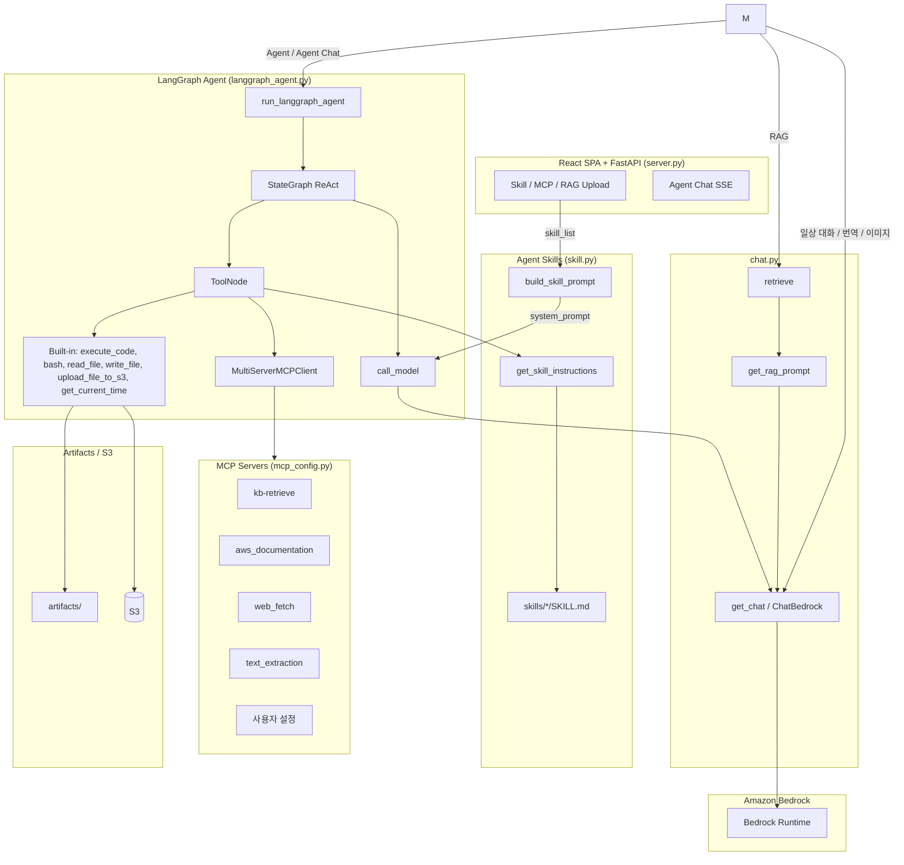

# Bedrock Data Automation (BDA)를 이용한 RAG 구현

## 개요

Amazon Bedrock Data Automation(BDA)은 문서, 이미지, 영상, 오디오 등 비정형 콘텐츠에서 가치 있는 인사이트를 추출하는 완전 관리형 클라우드 서비스입니다. 생성형 AI를 활용하여 멀티모달 데이터를 구조화된 형식으로 변환하며, 복잡한 AI 모델 오케스트레이션 없이 단일 API로 처리할 수 있습니다.

사용자는 FastAPI + React UI로 접속해 파일을 업로드하면 Amazon S3에 저장됩니다. Knowledge Base sync 시 BDA 파싱 후 chunking/embedding을 거쳐 OpenSearch Serverless에 인덱싱되고, Agent 채팅에서는 MCP로 Knowledge Base를 조회합니다. Hybrid(vector/keyword) 검색을 지원하며 문서 추가·삭제가 용이합니다. 상세 구성은 [시스템 아키텍처](#시스템-아키텍처)를 참고하세요. 


## 목차

1. [개요](#개요)
2. [시스템 아키텍처](#시스템-아키텍처) — 구성도, 동작 모드
3. [프로젝트 구조](#프로젝트-구조)
4. [Amazon Bedrock Data Automation](#amazon-bedrock-data-automation) — 개념, 모달리티, 활용 사례
5. [Knowledge Bases에서 BDA 파서 구성](#knowledge-bases에서-bda-파서-구성) — 파서 비교, API, IAM, 임베딩
6. [Metadata Filtering](#metadata-filtering-opensearch--bda)
7. [설치 및 실행](#설치-및-실행) — 배포부터 로컬 실행·정리까지
8. [문제 해결](#문제-해결)
9. [실행 결과](#실행-결과)
10. [참고 문서 링크](#참고-문서-링크)

## 시스템 아키텍처

본 애플리케이션의 런타임 구성과 질의 처리 모드입니다. BDA/Knowledge Base 설정 세부사항은 이어지는 절을 참고하세요.

### 구성도



## 프로젝트 구조

본 프로젝트는 크게 **AWS 인프라 자동화 스크립트**(루트 레벨)와 **FastAPI + React 기반 RAG Agent 애플리케이션**(`application/`)으로 구성되어 있습니다.

```
rag-automation/
├── README.md                  # 프로젝트 개요 및 BDA/RAG 구성 가이드 (본 문서)
├── requirements.txt           # Python 패키지 의존성 정의
├── run_local.sh               # 프론트 빌드 + uvicorn :8501
├── Dockerfile                 # FastAPI + React 컨테이너
│
├── installer.py               # AWS 인프라 일괄 배포 스크립트 (boto3)
├── installer.md               # installer.py 상세 문서 (생성 리소스/배포 순서)
├── uninstaller.py             # installer.py가 생성한 리소스 일괄 삭제 스크립트
├── add_content.py             # 콘텐츠를 S3 업로드 후 Knowledge Base 동기화
│
└── application/               # FastAPI + React 기반 Agent / RAG 애플리케이션
    ├── server.py              # FastAPI 진입점 + SPA 서빙
    ├── api/                   # REST/SSE 라우트
    ├── web/                   # React Vite SPA
    ├── services/              # rag_service 등
    ├── chat.py                # Bedrock 호출, RAG/이미지 분석 등 채팅 로직 핵심
    ├── info.py                # 사용 가능한 Bedrock 모델 카탈로그 정의
    ├── langgraph_agent.py     # LangGraph 기반 ReAct 에이전트 그래프 정의
    ├── mcp_config.py          # MCP 서버 프로파일 로더 (KB, AWS Docs, Tavily 등)
    ├── mcp_retrieve.py        # Bedrock Knowledge Base retrieve API 래퍼
    ├── mcp_server_retrieve.py # FastMCP 기반 KB retrieve MCP 서버 진입점
    ├── utils.py               # 공통 유틸리티 (설정 로드, 시크릿 조회 등)
    └── config.json            # 런타임 설정 (region, KB ID, S3 버킷, ARN 등)
```

### 루트 레벨 구성요소

| 파일 | 역할 |
|------|------|
| `installer.py` | S3, IAM, Secrets Manager, OpenSearch Serverless, VPC, ALB, CloudFront, EC2, Bedrock Knowledge Base를 순서대로 생성합니다. BDA 파서가 적용된 Knowledge Base를 자동으로 구성하고, 결과를 `application/config.json`에 기록합니다. 자세한 내용은 `installer.md` 참조. |
| `uninstaller.py` | `installer.py`가 만든 모든 AWS 리소스를 의존성 역순으로 안전하게 삭제합니다. |
| `requirements.txt` | `fastapi`, `uvicorn`, `boto3`, `langchain_aws`, `langgraph`, `mcp`, `langchain-mcp-adapters` 등 애플리케이션 실행에 필요한 Python 패키지를 정의합니다. |
| `run_local.sh` | React 프론트 빌드 후 `uvicorn application.server:app`를 포트 8501에서 기동합니다. |

### `application/` 디렉터리 구성요소

| 파일 | 역할 |
|------|------|
| `server.py` | FastAPI 진입점. `/api/*` 라우터와 React `web/dist` SPA를 동일 프로세스에서 서빙합니다. |
| `web/` | Vite + React UI (Agent 채팅, Skill/MCP 선택, RAG 업로드, 로컬 User ID 세션). |
| `api/` | 세션·설정·태스크·채팅 SSE·파일/RAG 업로드 라우트. |
| `chat.py` | 핵심 비즈니스 로직. `run_agent()`로 FastAPI에서 LangGraph 에이전트를 동기 실행합니다. |
| `info.py` | Nova Premier/Pro/Lite/Micro, Claude 등 사용 가능한 Bedrock 모델과 리전별 모델 ID를 카탈로그 형태로 정의합니다. |
| `langgraph_agent.py` | LangGraph `StateGraph` 기반 ReAct 에이전트를 정의합니다. MCP 툴을 바인딩한 LLM 노드와 `ToolNode`를 연결해 도구 호출 루프를 실행합니다. |
| `mcp_config.py` | 선택된 MCP 서버 종류(`RAG`, `aws_documentation`, `websearch`, 사용자 설정 등)에 따라 `MultiServerMCPClient`가 사용할 설정을 동적으로 빌드합니다. |
| `mcp_retrieve.py` | `bedrock-agent-runtime.retrieve`로 Hybrid 검색 + `owner` metadata 필터(`listContains`)를 적용합니다. MCP env의 `RAG_USER_ID`로 사용자 스코프를 강제합니다. |
| `mcp_server_retrieve.py` | `FastMCP`로 노출되는 MCP 서버. `retrieve` 툴 하나를 제공하며 내부적으로 `mcp_retrieve.retrieve`를 호출하여, 에이전트가 RAG 검색을 도구로 사용할 수 있도록 합니다. |
| `utils.py` | `config.json` 로드, S3 업로드, KB sync, 사용자 세션 디렉터리 등 공통 헬퍼. |
| `config.json` | `installer.py` 실행 결과로 생성/갱신되며 `region`, `projectName`, `accountId`, `knowledge_base_id`, `collectionArn`, `s3_bucket`, `sharing_url`(CloudFront 도메인) 등 런타임에서 참조하는 핵심 식별자를 보관합니다. |

### 실행 흐름 요약

1. **인프라 프로비저닝** — `python installer.py` 실행 시 BDA 파서가 적용된 Knowledge Base와 EC2/ALB/CloudFront 스택이 생성되고 `application/config.json`이 자동으로 채워집니다.
2. **콘텐츠 적재** — Web UI에서 로컬 파일을 선택하여, S3에 업로드하고 BDA 기반 인제스션 잡을 트리거합니다.
3. **애플리케이션 실행** — `uvicorn application.server:app --port 8501` (또는 `./run_local.sh`)로 FastAPI + React UI를 기동합니다.
4. **질의 처리** — React UI에서 Agent 채팅을 보내면 `/api/tasks/{id}/chat` SSE → `chat.run_agent` → `langgraph_agent`로 Skill/MCP(RAG 포함) 도구를 호출합니다.

## Amazon Bedrock Data Automation

BDA는 문서·이미지·동영상·오디오 같은 **비정형(Unstructured) 멀티모달 콘텐츠**에서 인사이트를 추출해 **구조화된(Structured) 데이터**로 바꾸는 완전 관리형 서비스입니다. 여러 AI 모델을 직접 오케스트레이션할 필요 없이 **단일 API**로 전처리를 수행하며, 채팅/추론 레이어가 아니라 RAG·Agent·Knowledge Base가 제대로 동작하기 위한 **데이터 전처리 레이어(파운데이션 빌딩 블록)** 역할을 합니다.

### Knowledge Bases와의 연동

Amazon Bedrock Knowledge Bases의 데이터 소스 수집(Ingestion) 단계에서 BDA를 파서(Parser)로 지정하면, PDF·이미지·오디오·비디오 등 멀티모달 콘텐츠를 검색 가능한 텍스트 표현으로 변환하거나, 멀티모달 임베딩을 위한 원본/파생 파일을 지정한 S3에 저장할 수 있습니다. 기본 파서는 텍스트만 추출하므로 도표·차트·표·이미지가 포함된 문서에서는 BDA(또는 파운데이션 모델 파서) 사용을 권장합니다. 이렇게 추출된 풍부한 모달리티별 표현이 RAG 질의응답의 검색 품질을 높입니다.

```
비정형 데이터 (PDF / 이미지 / 영상 / 오디오)
        ↓
   [BDA: 전처리·파싱 레이어]
        ↓
  구조화된 텍스트 / JSON (+ 필요 시 S3에 미디어 저장)
        ↓
   Knowledge Base (청킹·임베딩·인덱싱)
        ↓
   RAG / Agent → Claude 등 LLM
```

### 핵심 구성 요소

| 구성 요소 | 설명 |
|-----------|------|
| **단일 통합 API** | 문서·이미지·영상·오디오를 하나의 인터페이스로 처리 |
| **Blueprint** | 어떤 필드를 어떻게 추출할지 정의하는 설정 아티팩트 (Custom Output) |
| **Project** | Standard/Custom 설정을 묶어 파일 유형별로 적용하는 단위. `InvokeDataAutomationAsync`에서 참조 |
| **Standard Output** | 파일 유형별 기본 인사이트(문서 요약, 음성 전사, 장면 요약 등) 자동 추출 |
| **Custom Output** | Blueprint로 비즈니스 요건에 맞는 필드를 정확히 추출 (문서·이미지·오디오) |

### 지원 모달리티

| 모달리티 | 주요 처리 |
|----------|-----------|
| **문서** | 텍스트 추출, 분류, 정규화, 검증 등 IDP 파이프라인 자동화 |
| **이미지** | OCR, 시각 설명, 부적절 콘텐츠 탐지 등 |
| **동영상** | 장면별 요약, 화면 텍스트 추출, 콘텐츠/광고 분류, 키 모먼트 |
| **오디오** | 음성 전사(Transcription), 요약·대화 분석 |

### 차별화 포인트

- **멀티모달 통합 처리** — 모달리티별 서비스를 따로 묶지 않고 단일 API로 처리
- **내장 품질 보증** — Visual Grounding(추출 근거 위치), Confidence Score로 결과 신뢰도 확인
- **IDP 자동화** — 분류 → 추출 → 정규화 → 검증을 별도 오케스트레이션 없이 수행
- **비동기 처리** — 대용량 파일은 `InvokeDataAutomationAsync`로 처리 후 결과를 S3에 JSON으로 저장 (Knowledge Bases 인제스션에서도 BDA 파싱은 동기 응답이 아닌 수집 잡의 일부로 수행)

### 활용 사례

비정형 데이터가 많은 도메인에서 특히 효과적입니다.

- **지능형 문서 처리 (IDP):** 계약서, 청구서, 양식 등에서 구조화된 데이터 추출 및 분류, 복잡한 오케스트레이션 없이 대규모 자동화 가능
- **멀티미디어 분석:** 영상에서 장면 요약, 부적절 콘텐츠 감지, 광고/브랜드 분류, 지능형 영상 검색 지원
- **RAG 강화:** 문서/이미지/오디오/비디오를 모두 포함하는 지식 베이스 구축으로 질의응답 정확도 향상
- **회의록/강의 분석:** 오디오 및 비디오 파일의 트랜스크립트 및 요약 자동 생성
- **복합 문서 검색:** PDF 내 도표, 차트, 표, 이미지가 포함된 문서의 시맨틱 검색

> **참고:** Standalone BDA 호출은 비동기·S3 결과 저장이 기본이며, 페이지/항목 수 기준 과금입니다. Knowledge Bases 파서로 쓸 때의 옵션 비교·제한·IAM·스토리지 설정은 [Knowledge Bases에서 BDA 파서 구성](#knowledge-bases에서-bda-파서-구성)을 참고하세요.


## Knowledge Bases에서 BDA 파서 구성

Knowledge Bases 인제스션에서 BDA를 파서로 쓸 때의 옵션, 제한, API·권한·스토리지 설정을 정리합니다.

### 파서 옵션 비교

Knowledge Bases에서 사용할 수 있는 파서는 세 가지입니다.

| 구분 | 기본 파서 (Default) | BDA 파서 | 파운데이션 모델 파서 |
|------|---------------------|----------|----------------------|
| 지원 형식 | .txt, .md, .html, .docx, .xlsx, .pdf (텍스트만) | PDF, JPEG, PNG, 오디오, 비디오 | PDF, JPEG, PNG, 구조화 문서 |
| 멀티모달 처리 | 불가 | 가능 (이미지, 도표, 표, 오디오, 비디오) | 가능 (이미지, 도표, 표) |
| 프롬프트 커스터마이징 | 불가 | 불가 | 가능 |
| 비용 구조 | 무료 | 페이지/이미지 수 기준 과금 | 입출력 토큰 수 기준 과금 |
| 파일 크기 합계 제한 | - | - | 최대 100 GB |

> **중요:** BDA 또는 파운데이션 모델을 파서로 선택하면, 해당 데이터 소스의 모든 PDF 파일에 해당 파서가 적용됩니다. 텍스트만 포함된 PDF도 예외 없이 과금 대상이 됩니다.

### BDA 파서가 처리하는 데이터 유형

#### 문서 (Documents)

- 지원 형식: PDF, TIFF, JPEG, PNG, DOCX
- 텍스트 추출, 도표/차트 설명, 표 구조 인식, 손글씨 인식 포함
- DOCX 파일은 내부적으로 PDF로 변환하여 처리 (이 경우 페이지 번호 매핑 불가)

#### 이미지 (Images)

- 지원 형식: JPEG, PNG
- 이미지 내 텍스트 추출(OCR), 시각적 설명 생성

#### 오디오 (Audio)

- 지원 형식: AMR, FLAC, M4A, MP3, Ogg, WAV
- 지원 언어: 영어, 독일어, 스페인어, 프랑스어, 이탈리아어, 포르투갈어, 일본어, 한국어, 중국어 (대만, 광둥어 포함)
- 음성을 텍스트 트랜스크립트로 변환

#### 비디오 (Video)

- 지원 형식: MP4, MOV, AVI, MKV, WEBM (H.264, H.265/HEVC, VP8, VP9 등 코덱 지원)
- 장면 요약, 텍스트 추출, 콘텐츠 분류, 오디오 트랜스크립트 생성

### 출력 방식 (Standard / Custom / Project)

BDA는 크게 두 가지 출력 방식을 제공합니다.

#### 표준 출력 (Standard Output)

별도의 블루프린트(Blueprint)나 프로젝트 없이 파일을 전송하면 해당 파일 유형에 맞는 기본 출력을 반환합니다.

| 데이터 유형 | 기본 출력 내용 |
|-------------|----------------|
| 문서 | 텍스트 추출, 문서 요약 |
| 오디오 | 전체 트랜스크립트, 요약 |
| 비디오 | 장면 요약, 감지된 텍스트, 콘텐츠 분류 |
| 이미지 | 텍스트 추출, 시각적 설명 |

#### 커스텀 출력 (Custom Output)

블루프린트를 사용하여 추출할 필드를 정확하게 정의합니다. 문서, 오디오, 이미지에 적용 가능하며 비즈니스 워크플로에 특화된 정보 추출이 가능합니다.

#### 프로젝트 (Projects)

표준 출력 및 커스텀 출력 구성을 하나의 리소스로 관리합니다. `InvokeDataAutomationAsync` API 호출 시 프로젝트 ARN을 지정하면 해당 구성에 따라 파일이 처리됩니다.

- 프로젝트당 최대 블루프린트 수: 40개
- 계정당 최대 프로젝트 수: 100개
- `LIVE` / `DEVELOPMENT` 두 가지 스테이지 지원
- `DEVELOPMENT` 스테이지는 콘솔에서 접근 불가, API를 통해서만 변경 및 호출 가능

### 파일 처리 제한 사항

#### 비동기(Async) 처리 제한

| 항목 | 제한 |
|------|------|
| 최대 페이지 수 (문서 분할 활성화 시) | 3,000 페이지 |
| 최대 파일 크기 | 500 MB |
| 최대 비디오 길이 | 240분 |
| 최대 오디오 길이 | 240분 |
| 최대 이미지 해상도 | 8K |
| 최소 텍스트 감지 높이 | 15픽셀 (150 DPI 기준 8pt 폰트) |

#### 동기(Sync) 처리 제한

| 항목 | 제한 |
|------|------|
| 최대 페이지 수 | 10 페이지 |
| 최대 파일 크기 | 50 MB |

#### 추가 제약

- 수직 방향 텍스트 (일본어, 중국어 등 세로쓰기) 인식 미지원
- 비밀번호로 보호된 PDF 처리 불가
- PDF 최대 높이/너비: 40인치 / 9,000포인트

#### 프로젝트/블루프린트 제한

| 항목 | 제한 |
|------|------|
| 프로젝트당 최대 블루프린트 수 | 40개 |
| 계정당 최대 프로젝트 수 | 100개 |
| 계정당 최대 블루프린트 수 | 1,000개 |
| 블루프린트 최대 이름 길이 | 60자 |
| 블루프린트 최대 크기 | 100,000자 (JSON 형식) |

### API 구성 방법

Knowledge Bases 데이터 소스 생성 시 파싱 전략을 `BEDROCK_DATA_AUTOMATION`으로 설정합니다.

#### ParsingConfiguration 구조

```json
{
  "parsingStrategy": "BEDROCK_DATA_AUTOMATION",
  "bedrockDataAutomationConfiguration": {
    "parsingModality": "MULTIMODAL"
  }
}
```

- `parsingStrategy`: `BEDROCK_FOUNDATION_MODEL` 또는 `BEDROCK_DATA_AUTOMATION` 중 선택
- `parsingModality`: `MULTIMODAL` 지정 시 텍스트와 이미지를 모두 포함한 멀티모달 파싱 활성화
- BDA 또는 파운데이션 모델 파서가 파일 파싱에 실패하면, 자동으로 기본 파서로 폴백(fallback) 처리

#### AWS CLI를 이용한 Knowledge Base 생성 예시

```bash
aws bedrock-agent create-knowledge-base \
  --cli-input-json file://kb-bda-parser.json
```

`kb-bda-parser.json` 파일 내용 (플레이스홀더를 실제 값으로 교체):

```json
{
  "knowledgeBaseConfiguration": {
    "vectorKnowledgeBaseConfiguration": {
      "embeddingModelArn": "arn:aws:bedrock:us-east-1::foundation-model/amazon.nova-2-multimodal-embeddings-v1:0",
      "supplementalDataStorageConfiguration": {
        "storageLocations": [
          {
            "type": "S3",
            "s3Location": {
              "uri": "s3://<multimodal-storage-bucket>/"
            }
          }
        ]
      }
    },
    "type": "VECTOR"
  },
  "storageConfiguration": {
    "opensearchServerlessConfiguration": {
      "collectionArn": "arn:aws:aoss:us-east-1:<account-id>:collection/<collection-id>",
      "vectorIndexName": "<index-name>",
      "fieldMapping": {
        "vectorField": "<vector-field>",
        "textField": "<text-field>",
        "metadataField": "<metadata-field>"
      }
    },
    "type": "OPENSEARCH_SERVERLESS"
  },
  "name": "<knowledge-base-name>",
  "description": "Knowledge base with BDA parser"
}
```

### 임베딩 모델과의 조합

BDA 파서는 두 가지 임베딩 모델 접근 방식과 함께 사용할 수 있습니다.

#### 텍스트 임베딩 + BDA 파서

- Titan Text Embeddings v2 등 텍스트 임베딩 모델과 함께 사용합니다.
- BDA가 멀티모달 콘텐츠를 텍스트로 변환하여 저장합니다.
- 텍스트 기반 검색만 가능하나, 멀티모달 파싱 결과가 검색에 활용합니다.

#### Nova 멀티모달 임베딩 + BDA 파서

- BDA 파싱이 먼저 수행된 후 Nova 멀티모달 임베딩이 적용됩니다.
- 이 경우 Nova가 이미지/오디오/비디오에 대한 네이티브 멀티모달 임베딩을 생성하지 않고, BDA의 텍스트 변환 결과를 사용합니다.

#### 임베딩 모델 선택 가이드

| 상황 | 권장 구성 |
|------|-----------|
| 텍스트 문서 위주, 멀티모달 불필요 | 기본 파서 + 텍스트 임베딩 |
| PDF/이미지 포함, 텍스트 기반 검색 | BDA 파서 + 텍스트 임베딩 |
| 이미지/오디오/비디오 직접 시각 검색 | BDA 파서 + Nova 멀티모달 임베딩 |
| 음성 콘텐츠 검색 필요 | BDA 파서 (Nova 멀티모달 임베딩은 음성 검색 지원 제한적) |
| 이미지 전용 데이터셋 검색 | Titan Multimodal Embeddings G1 + 기본 파서 |

### 멀티모달 스토리지 설정

| 구분 | Nova 멀티모달 임베딩 | BDA 파서 |
|------|----------------------|----------|
| 스토리지 설정 | 필수 | 선택 사항 |
| 스토리지 미설정 시 | 멀티모달 처리 불가 | 텍스트 파싱만 가능 |
| 스토리지 설정 시 | 이미지/오디오/비디오 직접 검색 가능 | 이미지/오디오/비디오 멀티모달 파싱 가능 |

#### 스토리지 구성 권장 사항

- **별도 버킷 사용 (권장):** 데이터 소스 버킷과 멀티모달 스토리지 버킷을 분리하여 구성합니다. 설정이 단순하며 충돌 방지에 효과적입니다.
- **동일 버킷 사용 시:** 데이터 소스에 포함 접두사(inclusion prefix)를 반드시 지정하여 추출된 미디어 파일이 재수집되지 않도록 해야 합니다.
- **`aws/` 접두사 사용 금지:** 동일 버킷 사용 시, `aws/`로 시작하는 포함 접두사는 사용할 수 없습니다. 해당 경로는 추출된 미디어 저장용으로 예약되어 있습니다.


### Cross-Region Inference (CRIS) 필수 요건

BDA는 크로스 리전 추론(Cross-Region Inference)을 반드시 사용해야 합니다. 이를 통해 요청된 지리적 경계 내에서 최적의 리전을 자동으로 선택하여 처리하며, 추가 비용은 발생하지 않습니다.

데이터는 원본 소스 리전에만 저장되며, 전송 중에는 AWS의 암호화된 보안 네트워크를 통해 처리됩니다.

| 소스 리전 | ARN 패턴 | 처리 가능 리전 |
|-----------|----------|----------------|
| US East (N. Virginia) | `arn:aws:bedrock:us-east-1:account-id:data-automation-profile/us.data-automation-v1` | us-east-1, us-east-2, us-west-1, us-west-2 |
| US West (Oregon) | `arn:aws:bedrock:us-west-2:account-id:data-automation-profile/us.data-automation-v1` | us-east-1, us-east-2, us-west-1, us-west-2 |
| Europe (Frankfurt) | `arn:aws:bedrock:eu-central-1:account-id:data-automation-profile/eu.data-automation-v1` | eu-central-1, eu-north-1, eu-south-1, eu-south-2, eu-west-1, eu-west-3 |
| Europe (Ireland) | `arn:aws:bedrock:eu-west-1:account-id:data-automation-profile/eu.data-automation-v1` | eu-central-1, eu-north-1, eu-south-1, eu-south-2, eu-west-1, eu-west-3 |
| Europe (London) | `arn:aws:bedrock:eu-west-2:account-id:data-automation-profile/eu.data-automation-v1` | eu-west-2 |
| Asia Pacific (Mumbai) | `arn:aws:bedrock:ap-south-1:account-id:data-automation-profile/apac.data-automation-v1` | ap-northeast-1/2/3, ap-south-1/2, ap-southeast-1/2/4 |
| Asia Pacific (Sydney) | `arn:aws:bedrock:ap-southeast-2:account-id:data-automation-profile/apac.data-automation-v1` | ap-northeast-1/2/3, ap-south-1/2, ap-southeast-1/2/4 |
| AWS GovCloud (US-West) | `arn:aws:bedrock:gov-cloud:account-id:data-automation-profile/us-gov.data-automation-v1` | us-gov-west-1 |

#### CRIS IAM 정책 예시

```json
{
  "Effect": "Allow",
  "Action": ["bedrock:InvokeDataAutomationAsync"],
  "Resource": [
    "arn:aws:bedrock:us-east-1:<account_id>:data-automation-profile/us.data-automation-v1",
    "arn:aws:bedrock:us-east-2:<account_id>:data-automation-profile/us.data-automation-v1",
    "arn:aws:bedrock:us-west-1:<account_id>:data-automation-profile/us.data-automation-v1",
    "arn:aws:bedrock:us-west-2:<account_id>:data-automation-profile/us.data-automation-v1"
  ]
}
```

### IAM 권한 구성

BDA를 Knowledge Bases의 파서로 사용하려면 아래 IAM 권한이 필요합니다.

#### BDA 파서 기본 권한

```json
{
  "Effect": "Allow",
  "Action": [
    "bedrock:InvokeDataAutomationAsync",
    "bedrock:GetDataAutomationStatus"
  ],
  "Resource": [
    "arn:aws:bedrock:us-east-1:<account_id>:data-automation-profile/us.data-automation-v1",
    "arn:aws:bedrock:us-west-2:<account_id>:data-automation-profile/us.data-automation-v1"
  ]
}
```

#### 멀티모달 스토리지 S3 권한

멀티모달 스토리지 대상 버킷에 대한 S3 읽기/쓰기 권한이 필요합니다.

```json
{
  "Effect": "Allow",
  "Action": [
    "s3:GetObject",
    "s3:PutObject",
    "s3:ListBucket"
  ],
  "Resource": [
    "arn:aws:s3:::<multimodal-storage-bucket>",
    "arn:aws:s3:::<multimodal-storage-bucket>/*"
  ]
}
```


## Metadata Filtering (OpenSearch + BDA)

Amazon Bedrock Knowledge Bases는 원본 문서와 함께 `파일명.확장자.metadata.json` sidecar를 S3에 올리면 문서별 커스텀 메타데이터를 인덱싱합니다.
조회 시 `Retrieve`의 `vectorSearchConfiguration.filter`로 사전 필터링한 뒤 유사도/하이브리드 검색을 수행합니다.

- 문서: [Include metadata](https://docs.aws.amazon.com/bedrock/latest/userguide/kb-metadata.html)
- 검색 옵션: [Configure queries](https://docs.aws.amazon.com/bedrock/latest/userguide/kb-test-config.html) (`overrideSearchType`, metadata filters)
- 파서: [Parsing options / BDA](https://docs.aws.amazon.com/bedrock/latest/userguide/kb-advanced-parsing.html) — BDA는 인제스션 시 멀티모달 PDF/이미지를 텍스트로 파싱하며, metadata sidecar 인덱싱과는 독립입니다.

이 프로젝트(OpenSearch Serverless)는 UI/API RAG 업로드 시 `application/services/rag_service.py`가
`docs/{projectName}/{user_id}/{file}.metadata.json` sidecar를 함께 올립니다.

### OpenSearch에서 허용되는 타입

OpenSearch Serverless는 `STRING` / `NUMBER` / `BOOLEAN` / **`STRING_LIST`** 를 지원합니다.

| 속성 | 타입 | 예시 | 용도 |
|------|------|------|------|
| `owner` | `STRING_LIST` | `["user01"]` | 업로더 `user_id` (listContains 필터) |
| `team` | `STRING` | `"mycompany"` | 팀/조직 스코프 |
| `created_time` | `NUMBER` | `1786366000` | Unix epoch(초). 범위 필터용 |
| `is_confidential` | `BOOLEAN` | `false` | 기밀 여부 |

> Neptune GraphRAG는 list 메타데이터를 거부하므로 `STRING` + `equals`를 씁니다.  
> 본 저장소(OpenSearch)는 `STRING_LIST` + `listContains`를 사용합니다.

메타데이터 파일 예시:

```json
{
  "metadataAttributes": {
    "owner": {
      "value": { "type": "STRING_LIST", "stringListValue": ["user01"] },
      "includeForEmbedding": false
    },
    "team": {
      "value": { "type": "STRING", "stringValue": "mycompany" },
      "includeForEmbedding": false
    },
    "created_time": {
      "value": { "type": "NUMBER", "numberValue": 1786366000 },
      "includeForEmbedding": false
    },
    "is_confidential": {
      "value": { "type": "BOOLEAN", "booleanValue": false },
      "includeForEmbedding": false
    }
  }
}
```

### 검색 설정

`mcp_retrieve.retrieve()` / `chat.retrieve()` 기본값:

```python
retrievalConfiguration={
    "vectorSearchConfiguration": {
        "numberOfResults": 5,
        "overrideSearchType": "HYBRID",  # OpenSearch: vector + keyword
        "filter": {
            "listContains": {"key": "owner", "value": "<user_id>"}
        },
    }
}
```

- **HYBRID**: OpenSearch Serverless에서 벡터 + 원문 키워드 검색 (BDA로 추출된 텍스트 청크에도 적용).
- **owner 필터**: `langgraph_agent.create_agent()`가 RAG MCP(`kb-retrieve`)에 `RAG_USER_ID`를 주입하고, retrieve는 해당 사용자 문서만 반환합니다.
- **페이지 번호**: OpenSearch + PDF에서 KB가 `x-amz-bedrock-kb-document-page-number`를 부여하면 참조에 1-based page로 표시합니다.


## 설치 및 실행

여기서는 [installer.py](./installer.py) 하나로 RAG 시스템 구동에 필요한 AWS 인프라(S3, OpenSearch Serverless, Bedrock Knowledge Base, VPC, ALB, CloudFront, EC2)를 일괄 배포하고, 애플리케이션은 FastAPI(`uvicorn application.server:app`, 포트 8501)로 기동하도록 설계되어 있습니다.

### 사전 준비 (Prerequisites)

| 항목 | 요구사항 |
|------|----------|
| AWS 계정 | 관리자 권한 또는 인프라 생성 권한 (IAM, S3, EC2, VPC, ALB, CloudFront, OpenSearch Serverless, Bedrock, Secrets Manager) |
| AWS 리전 | `us-west-2` (기본값, BDA / Nova / Claude 모델 사용 가능 리전) |
| Bedrock 모델 액세스 | AWS 콘솔 → Bedrock → **Model access** 에서 사용할 모델(Nova, Claude, Titan Embed v2 등) 활성화 필요 |
| Python | 3.10 이상 |
| AWS CLI | 자격증명 설정 완료 (`aws configure` 또는 SSO) |

### 1단계: 저장소 클론 및 의존성 설치

```bash
git clone https://github.com/kyopark2014/rag-automation && cd rag-automation

pip install -r requirements.txt
```

### 2단계: AWS 자격증명 설정

`installer.py`, `uninstaller.py`, `add_content.py` 모두 boto3 기본 자격증명 체인을 사용합니다. 다음 중 하나를 구성하세요.

```bash
aws configure                      # Access Key 방식
```

기본 리전 및 프로젝트명은 `installer.py` 상단에서 수정할 수 있습니다.

```python
project_name = "rag-automation"   # 최소 3자
region = "us-west-2"
```

### 3단계: AWS 인프라 배포

루트 디렉터리에서 `installer.py`를 실행하면 약 15~25분에 걸쳐 모든 리소스가 생성됩니다.

```bash
python installer.py
```

배포가 완료되면 콘솔에 다음 정보가 출력되고 `application/config.json`이 자동으로 채워집니다.

```
================================================================
Infrastructure Deployment Completed Successfully!
================================================================
  S3 Bucket:           storage-for-rag-project-<account_id>-us-west-2
  Knowledge Base ID:   XXXXXXXXXX
  OpenSearch Endpoint: https://xxxxxxxx.us-west-2.aoss.amazonaws.com
  ALB DNS:             http://alb-for-rag-automation-xxxx.us-west-2.elb.amazonaws.com/
  CloudFront URL:      https://xxxxxxxxx.cloudfront.net
================================================================
```

> CloudFront 배포는 완전히 활성화되기까지 15~20분이 추가로 소요될 수 있습니다. 자세한 옵션(`--run-setup`, `--verify-deployment`)과 생성 리소스 명세는 [`installer.md`](installer.md) 참조.

### 4단계: 문서 적재 및 Knowledge Base 동기화

배포가 끝나면 UI에서 파일을 업로드하면 문서와 함께 `.metadata.json` sidecar가 올라가고 Knowledge Base sync가 수행됩니다. 진행 상황은 AWS 콘솔 → **Bedrock → Knowledge Bases → 데이터 소스 → Sync history** 에서 확인할 수 있습니다.

### 로컬에서 애플리케이션 실행

로컬에서 아래처럼 UI를 띄워 테스트할 수 있습니다.

```bash
# 프론트 빌드 후 uvicorn (포트 8501)
./run_local.sh
```

또는 수동으로:

```bash
cd application/web && npm install && npm run build && cd ../..
uvicorn application.server:app --host 0.0.0.0 --port 8501
```

개발 시 HMR:

```bash
uvicorn application.server:app --host 0.0.0.0 --port 8501
cd application/web && npm run dev   # http://localhost:5173  (/api → :8501 프록시)
```

브라우저에서 `http://localhost:8501` 로 접속한 뒤 User ID로 로컬 세션을 시작합니다. Knowledge Base / S3 / Bedrock 호출은 모두 `config.json`에 기록된 리전·KB ID·역할을 통해 이루어집니다.

### 리소스 정리 (Uninstall)

테스트가 끝났다면 `uninstaller.py`로 `installer.py`가 만든 모든 리소스를 안전하게 삭제합니다.

```bash
python uninstaller.py            # 확인 프롬프트 표시
python uninstaller.py --yes      # 프롬프트 없이 즉시 삭제
```

CloudFront 비활성화에 시간이 걸려 일부 리소스가 남을 수 있으며, 이 경우 안내 메시지에 따라 잠시 후 다시 실행하면 됩니다.


## 문제 해결

| 증상 | 확인 사항 |
|------|----------|
| `AccessDeniedException` (Bedrock 호출) | Bedrock **Model access**에서 사용 모델을 활성화했는지, IAM 역할에 `bedrock:InvokeModel` / `bedrock:InvokeDataAutomationAsync` 권한이 있는지 확인 |
| `ResourceNotFoundException` (Knowledge Base) | `application/config.json`의 `knowledge_base_id`가 실제 KB와 일치하는지 확인 (mismatch 시 `mcp_retrieve.py`가 프로젝트명 기준으로 자동 복구 시도) |
| CloudFront 도메인 502/503 | 배포 직후 15~20분 활성화 대기, EC2 인스턴스 상태 및 ALB 타겟 그룹 헬스 확인 (포트 8501) |
| `add_content.py` 실행 시 config 로드 실패 | `python installer.py`로 인프라 배포가 정상 완료되어 `application/config.json`이 생성되었는지 확인 |
| BDA 파서 인제스션 실패 | 파일이 [BDA 처리 제한](#파일-처리-제한-사항)(500 MB / 3,000페이지 등)을 초과하지 않는지, 비밀번호로 보호된 PDF가 아닌지 확인 |


## 실행 결과

채팅창에서 "+" 버튼을 선택해서 [Upload to RAG]를 선택후 파일을 업로드 합니다. "nova-ug.pdf"를 업로드하였다면, "nova-ug.pdf.metadata.json"이 자동 생성되었음을 아래와 같이 알 수 있습니다.


"nova-ug.pdf.metadata.json"의 내용은 아래와 같습니다. 해당 파일의 owner, team, 생성일에 대한 정보를 가지고 있어서 검색시 filter로 활용될 수 있습니다.

```java
{
  "metadataAttributes": {
    "owner": {
      "value": {
        "type": "STRING_LIST",
        "stringListValue": [
          "user01"
        ]
      },
      "includeForEmbedding": false
    },
    "team": {
      "value": {
        "type": "STRING",
        "stringValue": "mycompany"
      },
      "includeForEmbedding": false
    },
    "created_time": {
      "value": {
        "type": "NUMBER",
        "numberValue": 1786371723
      },
      "includeForEmbedding": false
    },
    "is_confidential": {
      "value": {
        "type": "BOOLEAN",
        "booleanValue": false
      },
      "includeForEmbedding": false
    }
  }
}
```

이제 "knowledge base로 nova 모델 사용법을 조사하세요."라고 입력하면 아래와 같은 결과를 얻을 수 있습니다.


## 참고 문서 링크

| 문서 | URL |
|------|-----|
| Parsing options for your data source | https://docs.aws.amazon.com/bedrock/latest/userguide/kb-advanced-parsing.html |
| What is Bedrock Data Automation | https://docs.aws.amazon.com/bedrock/latest/userguide/bda.html |
| How Bedrock Data Automation works | https://docs.aws.amazon.com/bedrock/latest/userguide/bda-how-it-works.html |
| Prerequisites for using BDA | https://docs.aws.amazon.com/bedrock/latest/userguide/bda-limits.html |
| Cross Region support for BDA | https://docs.aws.amazon.com/bedrock/latest/userguide/bda-cris.html |
| Standard output in BDA | https://docs.aws.amazon.com/bedrock/latest/userguide/bda-standard-output.html |
| Bedrock Data Automation projects | https://docs.aws.amazon.com/bedrock/latest/userguide/bda-projects.html |
| ParsingConfiguration API Reference | https://docs.aws.amazon.com/bedrock/latest/APIReference/API_agent_ParsingConfiguration.html |
| BedrockDataAutomationConfiguration API | https://docs.aws.amazon.com/bedrock/latest/APIReference/API_agent_BedrockDataAutomationConfiguration.html |
| Create a knowledge base for multimodal content | https://docs.aws.amazon.com/bedrock/latest/userguide/kb-multimodal-create.html |
| Prerequisites for multimodal knowledge bases | https://docs.aws.amazon.com/bedrock/latest/userguide/kb-multimodal-prerequisites.html |
